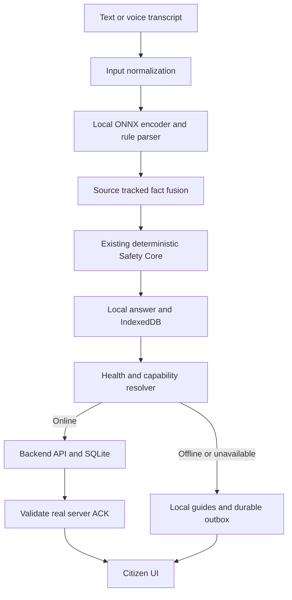

# nuRESQ Hybrid Foundation

Model classification is a candidate only. Confirmed SOS type and explicit parser facts determine the safety draft. Backend enrichment returns allowed guide IDs and unchanged locked priority, never replaces local safety. Conversation history, photos, audio and contacts are not sent. Only submitted text, minimal intent/priority and incident ID go to assistant analysis. Explicit SOS and messages sync from a durable outbox.

| Capability | Offline prepared localhost/PWA | Online |
|---|---|---|
| Local ONNX | Yes if assets prepared and supported; otherwise rules | Same |
| Deterministic safety | Yes (known blocking defects documented) | Same |
| Local guides | Yes | Yes |
| SOS creation / local storage | Yes | Yes |
| Queue | Yes | Yes |
| Backend sync / real server ACK | No | Yes after successful response |
| Responder / cloud agent | No | Not implemented |

IndexedDB v3 retains all existing stores and adds hybrid-outbox. Original snapshot uses existing incident UUID. Update ID and acknowledgement are independent. Original SOS ACK survives updates. Failed operations retain the original captured time and coordinates. The backend's received_at records arrival time only.

UI changes are limited to small local capability text and accurate delivery wording. Map, navigation/tracking/camera, styles and bottom navigation are not redesigned. Explicit legacy relay support remains; the hybrid foundation uses backend incident updates and makes no responder claims.
