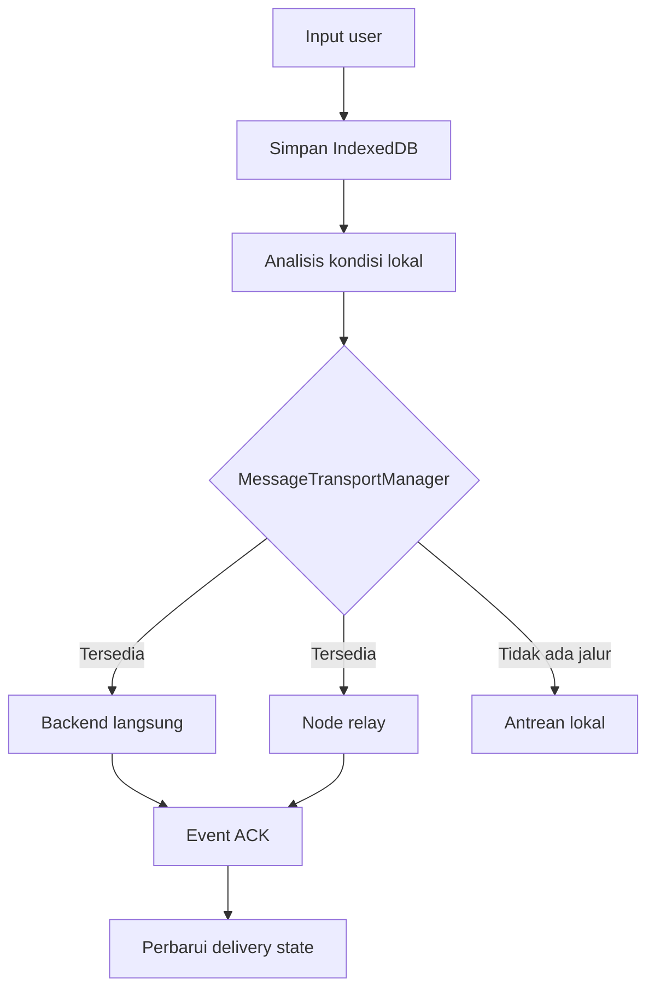
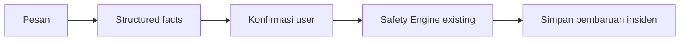

# nuRESQ Message Architecture

## Prinsip

Pesan adalah komunikasi insiden yang **local-first**. Status UI selalu berasal dari bukti yang tersimpan, bukan asumsi koneksi browser.



## Komponen

| Lapisan | Tanggung jawab |
| --- | --- |
| `MessagesPage` | Orkestrasi route Pesan, incident context, sheets, dan composer |
| `IncidentMessageHeader` | ID insiden, prioritas existing, status komunikasi |
| `ConversationList` | User/responder/system/AI/delivery presentation |
| `AIInsightPanel` | Perubahan penting yang belum dikonfirmasi |
| `SmartMessageComposer` | Text, AI Assist, voice capability, send/save |
| `MessageSheets` | AI Assist, detail delivery, attachment notice, confirmation |
| `useEmergencyMessages` | Load/persist, transport retry, insight dismissal, SOS update |
| `message-analysis` | Parser lokal dan structured facts; tidak menghitung severity |
| `message-service` | Canonical message creation dan confirmed incident update |
| `MessageTransportManager` | Pemilihan direct/relay/queue dan ACK transitions |
| `EmergencyRepository` | IndexedDB incidents + messages dalam database yang sama |

## Canonical message

Core record mencakup:

- `id` — UUID/id stabil untuk retry dan deduplikasi;
- `incidentId`;
- `senderType`;
- `createdAt`;
- `text`;
- `structuredUpdate`;
- `priority` sebagai prioritas pesan, bukan severity insiden;
- `deliveryState`;
- `transport`;
- acknowledgement/receipt IDs;
- ordered `deliveryEvents`;
- attachment references, tanpa base64;
- `simulation` marker.

## Delivery semantics

| State | Copy citizen | Bukti minimum |
| --- | --- | --- |
| `LOCAL_SAVED` | Tersimpan di perangkat | IndexedDB write selesai |
| `QUEUED` | Menunggu jalur pengiriman | Local record tersimpan |
| `SENDING` | Sedang dikirim | Transport attempt aktif |
| `RELAYING` | Sedang diteruskan | Relay adapter aktif |
| `GATEWAY_RECEIVED` | Gateway menerima | ACK gateway valid |
| `SERVER_ACKNOWLEDGED` | Diterima sistem | ACK server valid |
| `RESPONDER_RECEIVED` | Diterima responder | Receipt responder valid |
| `RESPONDER_READ` | Dibaca responder | Read receipt valid |

`navigator.onLine` atau event `online` tidak pernah menghasilkan state delivered.

## IndexedDB

Database existing `nuresq-emergency-core` dinaikkan ke versi 2. Store baru `messages` memiliki index:

- `incidentId`;
- `createdAt`;
- `deliveryState`.

Pembaruan incident + message confirmation disimpan dalam satu transaksi IndexedDB melalui `saveIncidentAndMessage`.

## AI Assist dan Safety Engine

Default portable memakai `DETERMINISTIC_LOCAL` untuk:

- tren/ketinggian air;
- pernapasan;
- mobilitas;
- lokasi lantai;
- jumlah korban eksplisit;
- baterai rendah;
- permintaan bantuan eksplisit.

Hasil parser hanya menjadi saran. Alur pembaruan:



Tidak ada jalur `AI → severity` dan tidak ada AI-generated responder message.

## Capability injection

Portable default tidak memiliki backend, relay, cloud coordinator, atau model AI lokal. Integrasi masa depan dapat memasang capability sebelum aplikasi dijalankan:

```ts
window.__NURESQ_MESSAGING__ = {
  backendEndpoint: "https://example.invalid/messages",
  relayAdapter,
  localModelAvailable: false,
  cloudCoordinatorAvailable: false,
};
```

Endpoint direct wajib merespons JSON:

```json
{
  "acknowledgementId": "ack-unique",
  "acknowledgedAt": "2026-09-02T05:00:00.000Z"
}
```

Tanpa payload tersebut, pesan kembali ke `QUEUED`.

## Batas capability saat ini

- Backend pesan produksi belum dikonfigurasi.
- Node relay/gateway belum dipasang.
- Model AI lokal belum dibundel; parser deterministik tetap bekerja offline.
- SpeechRecognition browser tidak dianggap offline voice.
- Lampiran media belum diaktifkan untuk jalur portable.
- Tidak ada responder chat tanpa receipt dari integrasi nyata.

Semua batas ini ditampilkan sebagai status normal, bukan error palsu atau klaim demo.
